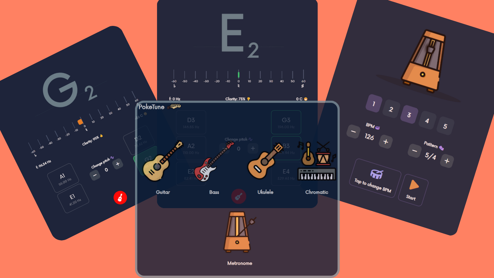

# PokeTune - Musical Instrument Tuner

PokeTune is a Progressive Web App (PWA) designed to help you tune your musical instruments with ease. Built using SvelteJS, this app provides a convenient way to achieve accurate tuning right from your web browser on any device.

## Features

- **User-Friendly Interface**: PokeTune boasts an intuitive and user-friendly interface, making it accessible to both beginners and experienced musicians.

- **Multiple Instrument Support**: Whether you're tuning a guitar, piano, violin, or any other instrument, PokeTune offers support for a wide range of musical instruments.

- **Built in Metronome** : Choose BPM and beats of your own.

- **Real-time Tuning**: With real-time feedback, you can adjust the tuning of your instrument and see the changes in pitch instantly on the app.

- **Visual Aid**: PokeTune provides visual aids, such as needle indicators or color-coded displays, to help you accurately tune your instrument.

- **Responsive Design**: The app is designed responsively, allowing you to use it seamlessly on various devices, including desktops, tablets, and smartphones.

## Installation

PokeTune is a Progressive Web App, which means you can access it directly through your web browser without needing to install it from an app store. Simply navigate to the PokeTune website using your preferred web browser.

## Usage

1. **Access the App**: Open your web browser and navigate to the PokeTune website.

2. **Select Instrument**: Choose the instrument you want to tune from the available options.

3. **Tune Your Instrument**: Play the string or sound the note you want to tune. Adjust the tuning pegs or keys while observing the visual aid on the app. Aim to align the indicator with the target pitch.

4. **Real-time Feedback**: As you adjust the tuning, the app will provide real-time feedback, helping you achieve accurate tuning.

5. **Repeat as Needed**: Repeat the tuning process for each string or note of your instrument until you're satisfied with the tuning.

## Technologies Used

- SvelteJS: The app is built using the SvelteJS framework, allowing for efficient and reactive user interfaces.

- Web Audio API: PokeTune utilizes the Web Audio API to process audio signals and provide real-time pitch detection.

## Contributing

Contributions to PokeTune are welcome! If you'd like to contribute, please follow these steps:

1. Fork the repository.

2. Create a new branch for your feature or bug fix.

3. Make your changes and ensure they are appropriately tested.

4. Submit a pull request, explaining the changes you've made.

## Feedback and Support

If you encounter any issues while using PokeTune or have suggestions for improvements, please feel free to open an issue on the GitHub repository.

## License

PokeTune is released under the [GNU GPL License](LICENSE).

---

Enjoy tuning your musical instruments with PokeTune! If you find it helpful, consider sharing it with your musician friends.
